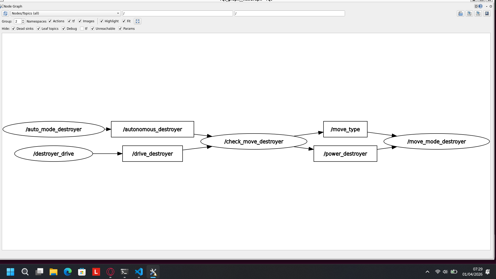

  
  Duce Anchovy, yang setia menemani dan membantu menyelesaikan tugas sang mas-mas sihir bernama Kazuma dan ketiga temannya

## Tugas Sekuro Day 2

## Identitas Cakru:
Nama: Bertrand Aurey Justinian
NIM: 13325096

## Penjelasan Program
Program terdiri atas 4 komponen, yakni:
- Auto node [`auto_mode_destroyer`] Kazuma-san ingin melakukan hal lain? Destroyer ini bisa gerak autopilot loh! Tinggal jangan kasih input selama 2 sekon
- Manual node [`manual_mode_destroyer`] Jika ingin mengendalikan destroyer, masukkan input dan input-input ini akan mendahului input dari [`auto_mode_destroyer`].
- Check mode [`check_mode_destroyer`] Bertugas untuk mendengarkan manual mode dan auto mode. Jika tiada input dari manual mode selama 2 sekon, maka Auto mode akan melakukan input. Berfungsi sebagai filter agar Move mode dapat menerima komando yang relevan (tidak tumpang tindih)
- Move mode [`move_mode_destroyer`] Menerima input dari check_mode_destroyer dan menggerakan destroyer (dalam bentuk angka)

Sistem ini dikonfigurasi menggunakan **Cyclone DDS** (`rmw_cyclonedds_cpp`) untuk memungkinkan komunikasi lintas-pengguna (User `aryxon` dan User `cakru18`) via protokol SSH.

## Diagram Program
Visualisasi hubungan antar node (rqt_graph):

## Dependencies
- **OS:** Ubuntu 22.04 LTS (Jammy Jellyfish) via WSL2
- **Middleware:** ROS 2 Humble Hawksbill
- **RMW Implementation:** `rmw_cyclonedds_cpp`
- **Compiler:** C++17

## Cara menjalankan program
Hai Kazuma-san! Walau kami di Anzio biasanya banyak masak pasta untuk bazzar festival setiap hari (dan habisin kas sekolah), namun khusus untuk kamu, Insinyur pemula kami sudah membuatkan kamu base untuk robot Destroyer II mu! Inilah cara untuk menjalankan kodenya:

1. Buka 4 terminal Ubuntu 22.04
2. Pastikan file sudah diakses melalui Ubuntu 22.04! Untuk mengaksesnya, jalankan perintah ini
`cd ~/tugas-d2-sekuro18-13325096`
3. Kemudian jalankan 2 perintah ini
`colcon build`
`source install/setup.bash`
dengan itu, Kazuma-san, kode-kode yang sudah dibuat insinyur magang Anzio sudah bisa diakses!
4. Jalankan perintah 2 dan 3 pada keempat terminal itu
5. Di terminal, kamu jalankan perintah
`ros2 run package_name *_mode_destroyer`
'*' ini diganti dengan:
Terminal 1: auto
Terminal 2: manual <- Di sini coba pencet2 W A S D untuk gerak, R L buat belok. Bisa remove speed limiter juga loh seperti Rosehip-san di tank Crusader-nya [Pencet shift desu-wa!]
Terminal 3: check
Terminal 4: move
6. Selamat mencoba Kazuma-san!

